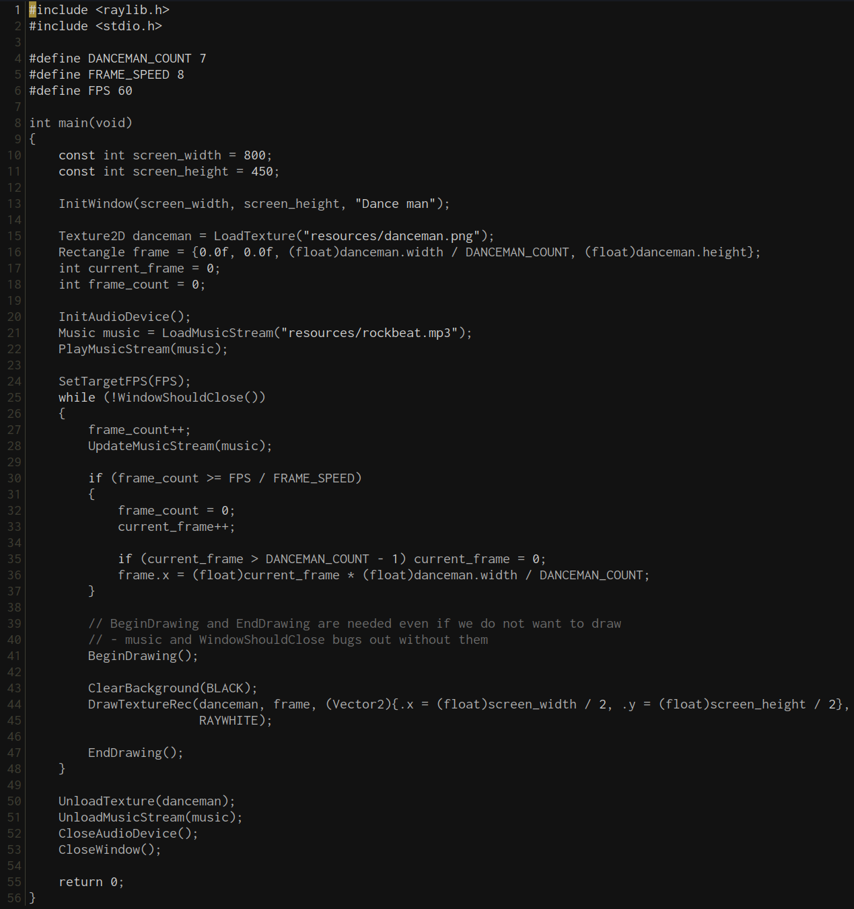

# fogbell.kak

Color scheme for [Kakoune](https://github.com/mawww/kakoune) based on fogbell.vim[https://github.com/jaredgorski/fogbell.vim]

## Screenshot

Example of some c code



## Installation

Download color scheme:

```bash
$ curl -L https://raw.githubusercontent.com/thomashrb/fogbell.kak/master/fogbell.kak -o ~/.config/kak/colors/fogbell.kak --create-dirs
```

Add to your `kakrc` file:

```kakoune
colorscheme fogbell
```
